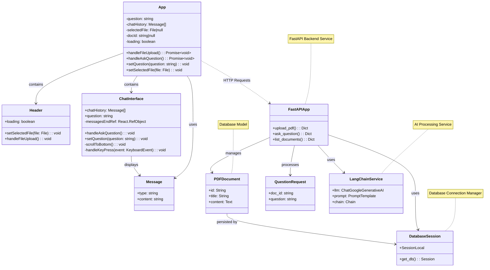

```mermaid
classDiagram
    %% Frontend Components
    class App {
        -question: string
        -chatHistory: Message[]
        -selectedFile: File|null
        -docId: string|null
        -loading: boolean
        +handleFileUpload(): Promise~void~
        +handleAskQuestion(): Promise~void~
        +setQuestion(question: string): void
        +setSelectedFile(file: File): void
    }

    class Header {
        +setSelectedFile(file: File): void
        +handleFileUpload(): void
        +loading: boolean
    }

    class ChatInterface {
        +chatHistory: Message[]
        +handleAskQuestion(): void
        +question: string
        +setQuestion(question: string): void
        -messagesEndRef: React.RefObject
        -scrollToBottom(): void
        -handleKeyPress(event: KeyboardEvent): void
    }

    class Message {
        +type: string
        +content: string
    }

    %% Backend Components
    class FastAPIApp {
        +upload_pdf(): Dict
        +ask_question(): Dict
        +list_documents(): Dict
    }

    class PDFDocument {
        +id: String
        +title: String
        +content: Text
    }

    class QuestionRequest {
        +doc_id: string
        +question: string
    }

    class DatabaseSession {
        +SessionLocal
        +get_db(): Session
    }

    class LangChainService {
        +llm: ChatGoogleGenerativeAI
        +prompt: PromptTemplate
        +chain: Chain
    }

    %% Relationships
    App --> Header : contains
    App --> ChatInterface : contains
    App --> Message : uses
    ChatInterface --> Message : displays
    FastAPIApp --> PDFDocument : manages
    FastAPIApp --> QuestionRequest : processes
    FastAPIApp --> DatabaseSession : uses
    FastAPIApp --> LangChainService : uses
    PDFDocument --> DatabaseSession : persisted by

    %% Integration
    App ..> FastAPIApp : HTTP Requests
    
    note for FastAPIApp "FastAPI Backend Service"
    note for PDFDocument "Database Model"
    note for LangChainService "AI Processing Service"
    note for DatabaseSession "Database Connection Manager"
```
